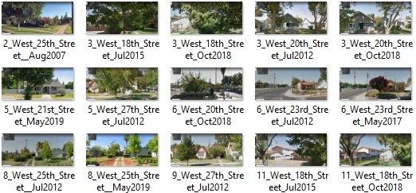
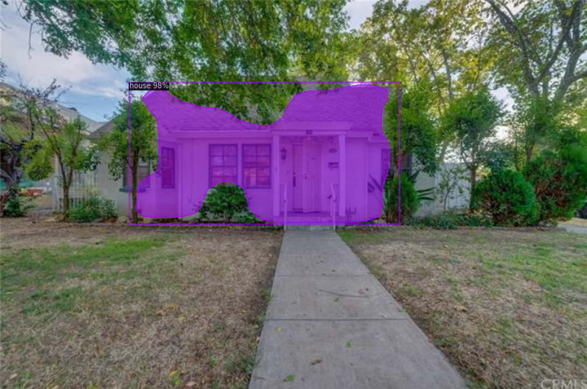

# Historic Places Merced

This project explores community-based research in the context of Digital Preservation. The aim of this repository is to acquire and investigate how the Historical Buildings in Merced have been preserved over time. This repository is heavily focused on the acquisition and processing of images using Automation, HTML parser libraries, and Convolutional Neural Networks. 

## Table of contents

- [Introduction](#introduction)
- [Methods](#methods)
    - [Image Acquisition](#image-acquisition)
    - [Data Processing](#data-processing)
    - [Image Segmentation](#image-segmentation)
- [Results](#results)
- [References](#references)
- [Contact](#contact)

### Introduction 

The historic building survey of the City of Merced started in 1977 and it was retaken in 1984 with more comprehensive survey including architectural descriptions, major alterations, and general data about the building ownership. However, there are not images and no record of the changes in this buildings since 1985 when the survey was finished. 

It is important to keep track of the preservation of this buildings , however, one of the challenges is the extensive list of building addresses. Therefore is interesting to explore less expensive ways using tools such as automation, HTML parsing, and convolutional neural networks to acquire and analyze data at a big scale.

### Methods 

#### 1. Image Acquisition 

##### Description 

This program currently supports 3 functionalities: 1. Download and naming of images using URLs, 2. Dynamic scraping using Selenium Webdriver and Jsoup, 3. Google Maps Street View API (key is required). The idea is to automatize the acquisition of images (it can be used to acquire any other information from the web) for the data preservation and research of the Historical Places Merced.  The idea behind this project is automate the image acquisition of houses in the city of Merced and use it to extract and compare images from different dates using Convolutional Neural Networks. 

##### Pre-requisites 

- Java Development Kit (jdk 13.0.1 or above)
- ChromeDriver
- Selenium Client & Webdriver for Java(stable version)
- Jsoup library

#### 2. Data Processing 

##### Description

The data processing of the projects include the workflow to organize and prepare datasets for training using the Detectron2 platform. The dataset was transformed in COCO format in order to be  registered and merged in the Detectron2 pretrained models. The data processing includes utilities such as resizing(deforming and without  deformation), naming, and visualization.

##### Pre-requisites

- Python3 (used with Jupyter Notebook)
- Pillow library
- LabelMe Annotation tool
- labelme2coco library

#### 3. Image Segmentation 

##### Description

The Jupyter Notebook includes the workflow of registering, training, data extraction, and implementation of the model. The first objective is to use instance segmentation to make assumption of the changes in the historic buildings of Merced as you will see in the results section below. The first version of the model demonstrated to be acceptable for the classification of houses, especially in images from google maps where there is multiple object such as trees that obstruct the view to the house. 

##### Model details

- Baseline[X101-FPN] with Mask R-CNN
- 240 images for training and 24 for validation (images from Google maps and Zillow, validation images randomly selected)

##### Pre-requisites

- Detectron2 vision library implemented in PyTorch
- List of other libraries needed visit the Google Colab

### Results 

### References 

B. Langborn, A. Liberda, A. Lilja, and J. Lindström, “Image segmentation and convolutional neural networks as tools for indoor scene understanding,” PhD Thesis, 2016.

City of Merced Redevelopment Agency. “CITY OF MERCED HISTORIC BUILDINGS SURVEY FINAL REPORT,” THE NATIONAL HISTORIC PRESERVATION ACT OF 1966, pp. 1–450.

C. Pesto, “Classifying U.S. Houses by Architectural Style Using Convolutional Neural Networks,” *Stanford University*, pp. 1–9

“Mask R-CNN,” *Facebook Research*. https://research.fb.com/publications/mask-r-cnn/ (accessed Jul. 15, 2020).

### Contact 
- avalle6@ucmerced.edu
